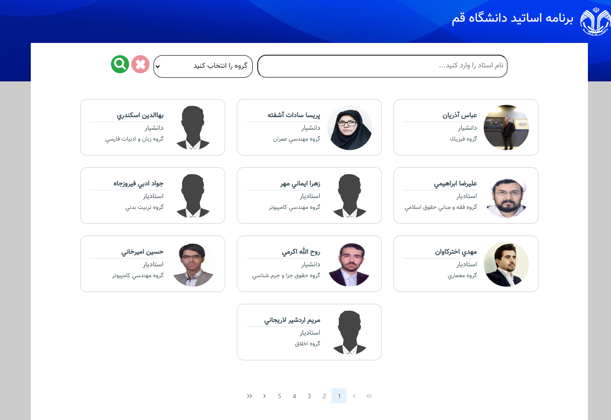

# professor_schedule_vue

# Project launch

## Change domain for deployment

If the location of the server-side application implemented with node js has changed, you must change its domain from https://schedule-professor.liara.run to the domain where you uploaded the application.

## install package

```
npm install
```

### Compiles and hot-reloads for development

```
npm run serve
```

### Compiles and minifies for production

```
npm run build
```




<p align="center">
  
  
</p>
